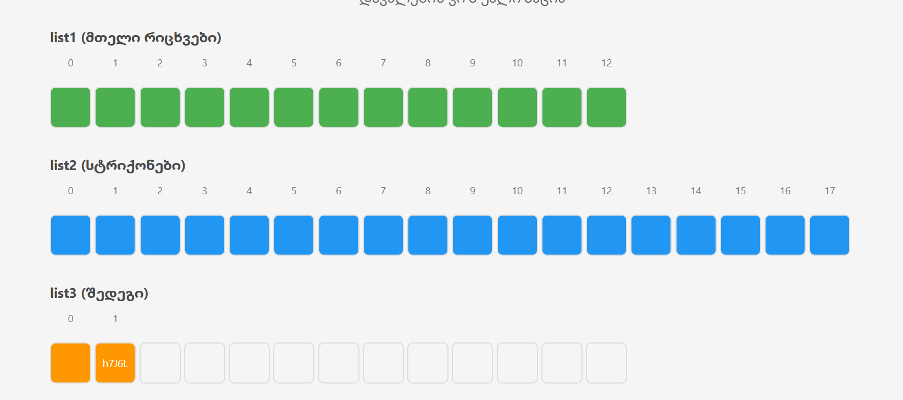

# AnimationProcess Java Project

This Java program simulates an animated process of transferring and manipulating values across three lists:

- **list1** is initialized with 17 numeric values.
- **list2** is filled with those values at random positions.
- **list3** is randomly populated with 12 string values from a predefined list.
- Then, values from **list3** are deleted step by step starting from index 0, then 1, 2, and so on, until only **5 values** remain.

##  Features

- Simulates a basic animation-like logic for list manipulation.
- Demonstrates data transfer, random insertion, and controlled deletion.
- Clean console output to trace the process step-by-step.

##  How It Works

1. **Initialization**
   - list1: `[8, 6, 2, 2, 9, 6, 3, 7, 7, 5, 7, 5, 8, 4, 3, 1, 0]`
   - originalStrings: contains 18 unique strings like `"RorE", "oJI", "WY2", ...`

2. **List Interchanges**
   - `list1` → `list2`: all integers are placed randomly.
   - `originalStrings` → `list3`: 12 randomly chosen strings are placed at random positions.

3. **Animated Deletion Simulation**
   - From `list3`, values are deleted in increasing index order until only 5 remain.
## Output Example

Here is an example output of one program execution:

List1 (Integer): [8, 6, 2, 2, 9, 6, 3, 7, 7, 5, 7, 5, 8, 4, 3, 1, 0]
List2 (String): [3, 7, 4, 6, 2, 1, 7, 9, 5, 0, 8, 5, 8, 2, 3, 6, 7]
List3 (Result): [Str, h7J6L, RorE, 1XSV4, CmJ, qi9, oHFFT, KgHH, WY2, UjFRw, oJI, x62U]

##  Visual Aid

